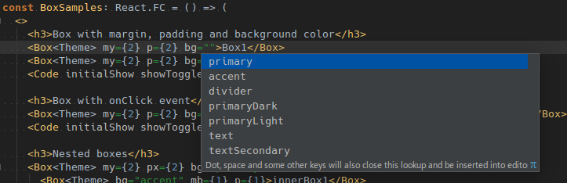

# Indoqa Style-System
This project provides an extensible style system for React with Typescript typed theme support
and several base components following the principle of [style as function of state](http://fela.js.org/docs/introduction/Principles.html):

* Base components as building blocks which are integrated with theming:
  * `<Box>` ([docs](./docs/base-components.md#Box))
  * `<Flex>` ([docs](./docs/base-components.md#Flex))
  * `<Text>` ([docs](./docs/base-components.md#Text))
  * `<Grid>`, `<Row>`, `<Panel>`, `<ColRow>`, `<Col>` ([docs](./docs/Grid.md))
* Typed components with Typescript

  
* A typed base theme with sensible defaults (e.g. font styles based on system fonts)
* Base CSS stylesheets ([Bootstrap Reboot 4.1](https://getbootstrap.com/docs/4.1/content/reboot/)
and [normalize.css](https://necolas.github.io/normalize.css/) are currently supported)

## Changelog
[Learn about the latest improvements](./CHANGELOG.md)

# Installation and usage
`yarn install @indoqa/style-system`

## Theming
Setup the application theme based on the [BaseTheme](./src/main/theming/baseTheme.ts) provided by Indoqa Style-System:

```typescript
import {BaseColors, BaseFontSizes, baseTheme, BaseTheme, typeScale} from '@indoqa/style-system'

interface FontSizes extends BaseFontSizes {
  readonly extraBig: number | string,
}

interface Colors extends BaseColors {
  readonly primary: string,
  readonly primaryDark: string,
  readonly primaryLight: string,
  readonly accent: string,
  readonly textSecondary: string
  readonly divider: string,
}

interface Layout {
  readonly actionBarHeight: number,
  readonly menuWidth: number,
}

export interface Theme extends BaseTheme {
  readonly fontSizes: FontSizes,
  readonly colors: Colors,
  readonly layout: Layout,
}

const baseColors = {
  black_1: '#000000',
  black_2: '#120012',
  grey_1: '#727272',
  grey_2: '#BDBDBD',
  white_3: '#d5d5d5',
  white_1: '#ffffff',
  blue_1: '#c5cae9',
  blue_2: '#3f51b5',
  blue_3: '#303f9f',
  orange_1: '#ff5722',
}

const baseFontSizes: FontSizes = {
  text: typeScale(1),
  big: typeScale(2),
  veryBig: typeScale(3),
  extraBig: typeScale(3),
  small: typeScale(0),
  verySmall: typeScale(-1),
}

const theme: Theme = {
  breakpoints: baseTheme.breakpoints,
  colors: {
    primary: baseColors.blue_2,
    primaryDark: baseColors.blue_3,
    primaryLight: baseColors.blue_1,
    accent: baseColors.orange_1,
    text: baseColors.black_2,
    textSecondary: baseColors.grey_1,
    divider: baseColors.white_1,
  },
  fontSizes: baseFontSizes,
  fontStyles: baseTheme.fontStyles,
  layout: {
    actionBarHeight: 50,
    menuWidth: 300,
  },
  spacing: baseTheme.spacing,
  zIndexes: baseTheme.zIndexes,
}

export default theme
```

* The interface `Theme` extends the interface `BaseTheme`. This is important because all provided components are based on `BaseTheme`
  or extensions of it.
* The implementation `theme` uses `baseTheme` properties or overrides them.

## Fela setup
```typescript
import {BaseCssProps, createFelaConfig, renderRebootCss} from '@indoqa/style-system'
import {createRenderer} from 'fela'
...

const felaConfig = createFelaConfig()
const renderer = createRenderer(felaConfig)

const baseCssProps: BaseCssProps = ...

const App: React.FC = () => {
  React.useLayoutEffect(() => {
    renderRebootCss(renderer, baseCssProps)
  }, [])
  return (
    <RendererProvider renderer={renderer}>
      <Router history={history}>
        <ThemeProvider theme={theme}>
          <Switch>
            <Route path="/" component={StyleSystemUIExplorer}/>
          </Switch>
        </ThemeProvider>
      </Router>
    </RendererProvider>
  )
}

export default App
```

* `renderRebootCss` provides basic CSS styles based on the theme
* provide a `RendererProvider` (all React components can get access to the Fela renderer)
* provide a `ThemeProvider` (all React components can get access to the application theme)
* `createFelaConfig` configures Fela with all the plugins which are usually
  required for web applications. It also registers
  [named keys](https://github.com/rofrischmann/fela/tree/master/packages/fela-plugin-named-keys)
  for breakpoints and print styles which are aligned with the [PStyle](./docs/pstyle-and-breakpoints.md) type.

Complete samples can be found at [Indoqa Style-System demo](../style-system-demo/) and the [Indoqa React Starter](../react-starter/).

# Documentation
* [Base components](./docs/base-components.md#Box) (Box, Flex, Text)
* [Grid](./docs/grid.md)
* [PStyle and breakpoints](./docs/pstyle-and-breakpoints.md)
* [Theming](./docs/theming.md)

