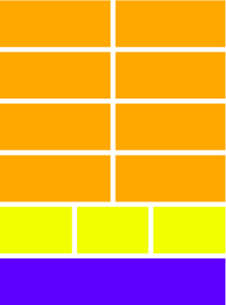

# Grid
This component simplifies the usage of CSS flexbox in many use cases.
The root component is `Grid` which contains rows and the rows
respectively contain panels or cols. It also allows setting a `spacing`
which is used throughout the grid.

Grids can be nested by putting a `Grid` into a `ColRow`.

## Example of a nested, responsive grid

### Desktop screen

### Mobile screen

## Properties
| Property          | Type                | Default      | Description |
|:----------------- |:--------------------|:-------------|:------------|
| `spacing`         | `number` \|`string` | unset        | Set the gutter width of the grid to a valid CSS length value. If a number is passed, it is interpreted as pixels. |
| `center`          | `boolean`           | `false`      | Center the grid within its container. |
| `maxWidth`        | `number`\|`string`  | `auto`       | Center CSS property `max-width`. |
| `children`        | `React.Node`        | `null`       | Allowed child component types are `Row` and `ColRow`. However, typescript cannot enforce these types (yet). |

# ColRow
The `ColRow` is a flex container which aligns its children based on a grid size of `12` columns (like [Bootstrap](https://getbootstrap.com/docs/4.3/layout/grid/)).
If it contains children with a sum of their sizes greater than 12, a row break is enforced.

## Properties
The following properties are the same as of `Box`:
* [Padding](./base-components.md/#Padding)
* [Style](./base-components.md/#style)
* [Additional CSS styles](./base-components.md/#additional-css-styles)

# Col
The `Col` component is a tile within a `ColRow`. Its size is relative to the
grid width.

## Properties
| Property | Type                  | Default | Description |
|:---------|:----------------------|:--------|:------------|
| `size`   | `number`\|`number[]`  |`12`     | The size indicates how many columns should be used. The maximum sum per row is 12. The allowed values are `1-12`.|

### Responsive styling
If the `Col` size is an array, the width is calculated based on the currently active breakpoint.
Breakpoints are defined in the `Theme` and the array position defines the breakpoint for which it should be used. It is
assumed that the breakpoints follow a mobile first approach which means that the default size (which is styled without a media query)
is the size of the smallest display and larger displays are defined by `min-width` media queries.

This means that the first value of the array is used for the smallest supported screen.

If there are fewer values in the array than breakpoints, the last value is being used for the remaining larger breakpoints.
